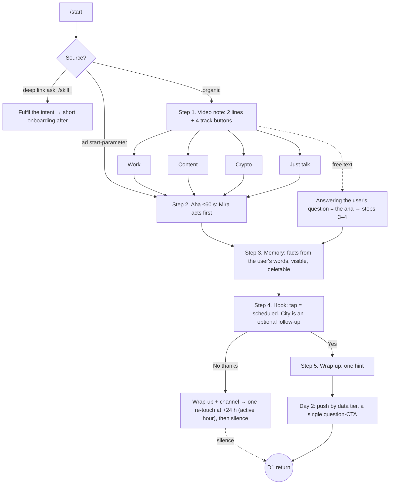

# PRD: Mira Onboarding

**Goal: maximize D1 retention** · Author: Maxim Sirotkin · v0.9 · July 14–15, 2026
*(v0.2 internal grilling → v0.3 first-session benchmark → v0.4 second touches → v0.5 mini-app wizard audit → v0.6 team answers: 0 starting tokens, no mini-app, setup-drop hole confirmed → v0.7 second review round (CEO/CPO/analyst) → v0.8 live observations: recovery push exists but generic & button-less → **v0.9 prototype shipped + prototype review fixes: 60-token grant with paid re-roll, referral at the zero-balance moment, "briefs stay free" policy, push stop rule, decliner re-touch at +24 h, mini-app entry surfaced as the upsell surface**)*

**Clickable prototype:** https://yrze.github.io/miraonboarding/

---

## 1. Context

Mira (@mira, ~444K MAU) is an AI agent inside Telegram: LLM chat, image/video/music generation, long-term memory, integrations (Gmail, Calendar, Notion, GitHub, 200+), reminders, Mira Daily, skills, a TON wallet (testnet), group chats. Chat and analysis are free; generation costs tokens (image 30 🪙, video 200 🪙 — the wiki says 100, production wins). **A new user starts with 0 tokens**; the first generation attempt hits "invite friends" (a referral program exists in production, reward amount not communicated). Without a subscription only budget models are available (MiniMax, DeepSeek, Qwen); top models are in Mira Pro.

### Telegram competitors (MAU from public t.me pages, Jul 14, 2026)

| Bot | MAU | Positioning | Retention mechanic |
|---|---|---|---|
| @GPT4Telegrambot | 2.9M | Every model in one place | Permanent free tier + /premium upsell |
| Syntx AI | 452K | 90+ models, generation-first | Welcome tokens + community channel (second touch at +5 min) |
| **Mira** | **444K** | **An agent: memory + actions** | Daily skills exist but are buried behind a form |
| Grok (@GrokAI) | 35K | Grok 3, Telegram Premium only | Platform paywall |
| Microsoft Copilot | 17K | "Everyday AI companion" | — |

**Two takeaways.** (1) Brand doesn't win here: Microsoft and xAI are an order of magnitude smaller than Mira — distribution and retention mechanics win. (2) The category leader grows on "cheap access to every model" — Mira should not race on price; it should win on what a free quota can't copy: memory, proactivity, actions.

### Real first sessions, benchmarked (screenshots, Jul 14, 2026)

| Bot | First message after /start | Asks for | Gives immediately | Next-day trigger |
|---|---|---|---|---|
| **Mira (current)** | Video note + `Let's go` → **6-screen mini-app wizard** (role, intent, name) → skill suggestions → in-chat setup via 3 open-ended questions | **A form before any value** | Nothing — zero results in the whole session | **Exists** (Daily Briefing/Motivation in suggestions + a recovery push), but never one tap away |
| Syntx | "5.50 tokens credited" + pricing + demo video | Figure out the menu | Tokens with no task attached | None in-bot; +5 min invite to a **broadcast channel** (mass, not personal) |
| GPT4Telegrambot | Commands + **inline buttons right in chat**; mini-app promoted as "easier, more features" but optional | Tap a button | A feature storefront | None |

**The key fact: nobody in the category delivers a personal comeback trigger down to a one-tap setup.** Syntx's channel is a mass broadcast. Mira is the only one that even tries (Daily in the wizard's suggestions, a recovery push "I'd love to write to you tomorrow" ~1–2 h after an abandoned setup) — but every attempt demands effort again: a form, a mini-app, a voice note. And no value is delivered within the first session at all.

**Current Mira onboarding, full picture** (audit, Jul 14): video note + `Let's go` → wizard: splash → "tell me about yourself" → role (17 chips) → intent (16 chips) → name (with "Random name") → skill suggestions incl. Daily Briefing/Motivation. `Try` → 3 essay questions before any result.

**Diagnosis** — the team clearly knows about the hook; the problem is **order and friction**:

1. **Investment before value**: 6 screens + 3 essay questions; the aha is only promised, never delivered.
2. **The hook is never one tap away**: wizard → suggestions → `Try` → interview; every step sheds users.
3. **Redundant steps**: the name screen (Telegram provides first_name), a splash with no action.
4. **Broken metaphor**: the product sells "an agent in your chat" but onboards with a form; suggestion matching is partial (picked PM + Have fun + Wanna talk → got content skills).
5. **Hole confirmed by a live test** (evening Jul 14): `Try` on Daily → 3 questions → user stays silent → Daily **is never scheduled**. ~1–2 h later a recovery push arrives: "I'd love to write to you tomorrow 🔔 …remind you to take pills, send BTC rate, nudge to drink water… Select a reminder in the app or send a voice 🎙". Right intent — proactively offering the trigger. Double friction in execution: (a) generic content — the wizard's role/intent/skill choices are ignored; (b) the CTA demands effort again — mini-app or a voice note, not a single one-tap button.
6. **Paywall shock** (fact): 0 starting tokens — the most common intent, "generate me an image", meets "invite friends" instead of a wow.

**What we honestly borrow from competitors**: welcome tokens communicated in the first touch (Syntx) — but tied to a task and abuse-protected; a "chat is free" line against paywall fear (the leader's "available for free"); a second touch to a still-warm user who dropped mid-flow (Syntx's timing); the channel as a zero-cost fallback for push-decliners.

### Retention patterns beyond Telegram

| Product | Pattern | Do we take it? |
|---|---|---|
| ChatGPT | Suggestion chips, memory | ✓ button hints; ✓ visible memory |
| Pi | Proactive check-ins | ✓ the core of our hook (strictly opt-in) |
| Replika / Character.ai | Persona, daily ritual | ✓ persona/style; ✗ streaks (not for a utility agent, v1) |
| Duolingo | Push discipline + exactly one next step | ✓ one CTA per message — no exceptions |
| GPT4Telegrambot | Permanent free tier; buttons in chat, mini-app optional | ✓ say "chat is free"; ✓ button-first chat onboarding is the behavioral norm; daily free tokens — v2 candidate |
| Alice (Yandex) | Contextual suggestion chips after every reply; a bundled morning ritual | ✓ chips after every first-session reply; the morning brief is already our core. (Hands-on check of Alice's chat onboarding still pending — web gave marketing only) |

## 2. Problem

The real death path of a new Mira user: /start → a form → `Try` → more questions → the user closes Telegram with zero value received and, likely, Daily never scheduled → the bot goes silent (or pushes something generic) → no return. Causes #1, #2, #5, #6 above are confirmed by the audit and live tests; #3–4 are hypotheses to verify with the funnel.

## 3. The core idea

> **Onboarding doesn't pitch what Mira can do. It does something useful now — and makes a deal about tomorrow.**

The D1 formula (Hooked model): **Aha now + Investment (memory) + Trigger tomorrow**.

Mira has a comeback channel ordinary apps don't: **the bot may message first** — personally, as an agent that remembers you. Onboarding is the ritual where the user sets that trigger with their own hands.

**This is a reorder, not a new mechanic**: every building block is live in production (Daily, memory, chips). Today's choreography: form → promise → hook at the end of a leaky path. Proposed: value in 60 seconds → memory along the way → hook in one tap.

**A quick win before any redesign**: hole #5 is fixed by a hotfix ("tap = push scheduled, defaults instead of questions") in the current flow — ship it immediately; it's the cheapest, confirmed D1 lever (§7, stage 0).

## 4. Goals & metrics

### North star
**D1 retention of new users** — ≥1 qualified interaction on **the next calendar day in the user's estimated time zone** (TZ estimate: /start hour — people start while awake — plus client language; refined by city if given). Sensitivity check: a 24–48 h window. **Qualified interaction**: a message, a voice note, a meaningful tap; **excluded**: push mute/settings taps. Every return event is tagged: `return_trigger ∈ {organic, daily_push, reengagement, anon_link, channel}`.

**Denominator**: first-ever /start per user_id (checked against history), anti-fraud filtered; traffic from ask_ links and referrals is a separate stratum, out of the primary analysis.

### Activation (proxies)

| Metric | Definition | Role |
|---|---|---|
| **Hook Setup Rate** ⭐ | % of new users with ≥1 **explicit opt-in** to a recurring touch (Daily tap / reminder). The anonymous link is NOT a hook | Primary D1 proxy |
| Viral Link Activation | % who shared their anonymous link or got ≥1 click on it | Viral loop, tracked separately |
| Aha Rate | % with an `aha_delivered` event — a track-specific result delivered (deep links: intent fulfilled) | Session quality |
| Memory Seed Rate | % with ≥2 memory facts after the first session | Push fuel |
| TTFV | /start → first valuable result; target ≤60 s | Speed |
| Push Reply Rate | % replying to the D1 push | Hook quality |

### Funnel (events)
`start` → `first_user_reply` → `track_selected | free_text_flow` → `aha_delivered` → `hook_setup` → `d1_return (return_trigger)`. Segmented by source: organic / ads / deep link.

### Guardrails
**D7 not worse than control within a set non-inferiority margin**; block rate (via the `my_chat_member` webhook — symmetric across arms); push disables by D7; support tickets (lag caveat); **invite/referral rate not worse** (the grant must not cannibalize referrals); **first purchase / Pro conversion by D7–14 and cohort ARPU not worse** (we don't buy D1 with revenue); COGS per new user.

## 5. The solution: onboarding flow

### Principles
- **Non-modal**: free text is always handled as normal chat; user intent beats the script. On the free-text path the answer itself IS the aha — steps 3–4 weave in after.
- **Value before any ask** — in every track, no exceptions.
- **Memory is visible and controllable**: only facts the user actually said; "say *forget it* and I'll delete".
- **One CTA per message** (Duolingo discipline), ≤60 s to aha.
- **Chips after every reply** (Alice/ChatGPT pattern): every first-session message ends with 2–3 contextual buttons — the next step is always one tap; effort is never mandatory.
- **No mini-app in the flow** (team's input): onboarding lives entirely in chat — but the mini-app entry stays pinned next to the input field, and once the hook is set the user gets a soft, non-CTA pointer to it (the mini-app is where the Pro upsell lives). The name screen is gone (first_name exists).
- **Source-aware**: an ad start-parameter routes straight into the matching track, skipping the picker.
- **Push degrades by design, not by accident** (tiers — see D1 push).

### Diagram

**Step 1.** Keep production's format — the video note (persona; **we do not promise video generation in the opener** — a 60 🪙 grant can't cover a 200 🪙 video), new text: 2 lines + 4 buttons. The current opener inverted: not "tell me about yourself first — then I'll be useful", but "pick what you need — I'll learn you along the way".

### Tracks: aha and hook

| Track | Aha ≤60 s (Mira acts first) | Tomorrow's hook | D2–D7 fuel |
|---|---|---|---|
| 💼 Work | **Inversion**: in ~10 s Mira renders a sample mini-brief herself (dynamic date, weather by TZ guess + one smart question; the calendar line is explicitly tagged *"once Calendar is connected"*) → "want this every morning — built around your tasks?" | Tap = subscribed to the morning brief | At the end: "send 2–3 tasks for tomorrow — I'll build them in" (investment AFTER demonstrated value); day-3 feature = "connect Calendar — the brief builds itself" |
| 🎨 Content | **60 🪙 welcome grant: first image 30, optional re-roll 30** (first generation is a lottery — a miss re-rolls, and the user learns token economics from minute one); the first generation runs on the **top model** (tiny fixed COGS, an honest Pro teaser) | "Fresh content ideas every morning?" — the push lands on **free** text ideas (Daily custom topics); generation is optional | Referral appears **only at the actual zero-balance moment** ("need more — invite a friend"); ideas stay free daily |
| 💎 Crypto | Live prices + "which 1–3 coins do you follow?" → **portfolio-lite in memory** → a personal take. The wallet stays out of onboarding while it's on testnet | "Morning digest on your coins?" | The digest runs on portfolio-lite — personal, not copyable by any broadcast channel |
| 💬 Just talk | Style picker (Friendly/Nerd/Cynic…) + a personal anonymous-questions link. Soft promise: "if someone asks — I'll bring it in the morning" | The hook is Mira herself: "either way, I'll have a question of the day for you — morning or evening?" (guaranteed) + the anon link on top (not guaranteed) | **Floor mechanic**: empty anon inbox → the push is not "sorry, nothing" but Mira's own question of the day in the chosen style |

Track composition is a hypothesis; validate against the pick statistics of the current wizard's 16 intent chips (the team already has this data). "Crypto" is the first candidate to swap (e.g. for "Study": School Student/Student/Teacher are 3 of the wizard's 17 role chips).

**Step 3. Memory.** Along the dialog Mira saves 2–3 facts **from what the user actually said** and shows it: "📌 Saved: you follow TON. Say *forget it* and I'll delete." No facts invented out of thin air.

**Step 4. Hook.** Buttons: `Yes, at 8:30` / `Another time` / `No thanks`. **A tap = the hook is scheduled, period** — no mandatory questions (the fix for hole §1.5). Right after the tap, one **optional** follow-up: "btw, what city are you in? I'll match time and weather." Silence cancels nothing: time runs on the TZ guess (/start hour + language), and with an unconfirmed TZ we send within a conservative window. `No thanks` is respected — with one deliberate exception: a **single re-touch at +24 h, timed to the hour the user was active yesterday** (a proven-online slot), value-first in the track's tone, with a one-tap "don't message me again" right on it. A second "no" = silence forever (that's what protects block rate). The wrap-up also offers the @miramedia_en channel (broadcast, zero COGS).

**Step 5. Wrap-up.** Exactly one CTA (the track's next step). Token balance is shown only if >0; otherwise the line is "always free: chat, photo analysis, music, reminders". A passive pointer (not a CTA) nudges the mini-app entry by the input — models, Pro and deeper settings live there.

**Day 2 — the D1 push, tiered by data completeness:**

| Tier | Data | Push |
|---|---|---|
| A | TZ confirmed + ≥2 facts | Full personal brief/digest + one question-CTA |
| B | TZ guessed + 1–2 facts | A short version built on known facts, no weather; ends with "change the time or topics in one word" |
| C | Nothing but the track | **No fake brief** — one live question in the track's tone (for "Just talk" — the question of the day in the chosen style) |

One CTA per push; the "feature of the day" appears only after the user replies, never inside the push. **Re-engagement, two lanes**: mid-flow droppers (no explicit refusal) get one ~22 h touch with concrete value from their session topic; explicit decliners get the single +24 h active-hour re-touch described in Step 4, with opt-out on the message. In both lanes: no reply / second "no" → silence. **Stop rule**: after 3 unanswered mornings the daily push auto-pauses (protects COGS and report rate).

### Edge cases
- **Deep links** (`ask_…`, skill shares): fulfil the intent first, then steps 3–4 in a single message. Don't break the viral loops.
- **Free text**: the answer is the aha; steps 3–4 follow.
- **Abandoned onboarding (still warm)**: silent for 10–15 min before the hook → one message with the cheapest action (Syntx's timing pattern). Exactly one.
- **Interrupted onboarding**: resume from the missing step (max once), never restart.
- **Groups**: the bot **cannot** DM the user who added it (platform restriction) → a deep-link button inside the group greeting: "Set up this chat's digest in DM".
- **Localization**: EN primary, RU by client language.

## 6. Economics (for CFO/CEO)

- **60 🪙 welcome grant (Content track only)**: first image 30, optional re-roll 30 — same COGS cap as "one image + one retry", but the user pays with tokens from minute one and learns the economy. New users currently get 0 🪙; CAC is already paid — losing the user to paywall shock costs more than the grant. **Anti-abuse**: the grant activates after the first meaningful action (not on a tap), heuristics (account age, grant→generate→leave pattern), a daily cap, a kill switch; **self-referral doesn't stack with the grant**. Token price in $ needed for the monthly budget (§9).
- **First generation and first push on the top model**: tiny fixed COGS per newcomer, first-impression quality + an honest Pro teaser.
- **One pricing story, no accidental paywalls**: daily text briefs stay free (budget model) — the retention loop is never paywalled; Pro sells the top model for generations and depth. (Prototype-review catch: an earlier copy line "first week on the top model, then Pro" effectively paywalled the habit loop — removed.)
- **Referral is not cannibalized but sequenced**: the grant covers the first desire, the referral covers the second — surfaced **only at an actual zero balance**; invite rate sits in guardrails.
- **Pushes are free** (team's input) + stop rule caps the long tail.
- **Path to revenue**: D1 → habit → generations → Pro (upsell from D1+, via the feature-of-the-day after a reply). **Rollout criterion: D1 uplift with a non-negative delta in revenue (first purchase / Pro by D7–14) and invite rate.**
- **Contrast with Syntx**: their retention is a cheap broadcast; ours is a personal push (costlier, but it differentiates the agent), with the channel as fallback.

## 7. Experiment (brief)

**Stage 0 — hotfix, no A/B (ship now)**: in the current Daily setup — "tap = scheduled, defaults instead of questions". Fixes the confirmed leak, resets the baseline; the cheapest D1 lever.
**Stage 1 — A/B of the redesign** on top of the fixed control: 50/50 on new users (first-ever /start, anti-fraud), primary metric D1, secondary D7 (with margin); inside treatment — a ~10% push-holdout (no bot-initiated messages for 7 days — clean organic D7) and a **grant-holdout** in the Content track (60/0) to unbundle choreography from tokens. ask_/referral traffic — separate stratum. ≥2 full weeks; power calculated from week-one actual intake. Cross-track comparisons are descriptive, not decisive.

## 8. Risks

| Risk | Mitigation |
|---|---|
| **Grant abuse**: multi-account farming, self-referral | Grant after a meaningful action, heuristics, cap, kill switch; self-referral doesn't stack; invite rate monitored |
| **Zombie-D1**: pushes inflate D1 without habit | D7 with margin, Push Reply Rate, push-holdout, `return_trigger` taxonomy |
| **Irrelevant default push** (user left no data) → burned trigger | Tiers A/B/C: a data-less push never pretends to be a brief |
| First impression on budget models kills the wow and the Pro story | First generation and first push on the top model |
| Pushes → blocks | Opt-in first; decliners get exactly one value-first re-touch with a one-tap opt-out, second "no" = silence forever; stop rule; block tracking via `my_chat_member`, symmetric |
| Token COGS | One track, cap, cost per incremental D1 before rollout |
| Onboarding blocks users with a ready intent | Free text always wins; start-parameter skips the picker |
| Breaking deep-link funnels | A separate short branch |

## 9. Team questions — status

**Closed** (Jul 15): baseline doesn't matter — build fresh and mini-app-free; current /start — full audit in §1; new users get **0 tokens**, 30/200 🪙 pricing, budget-model free tier, referral exists; no push restrictions; EN-heavy audience; pushes are free; A/B infra and skill matching don't affect the idea; abandoned setup = no push arrives (confirmed live).

**Open:**
1. Wallet mainnet timing (unclear) — until then the crypto aha runs on prices, no wallet.
2. Grant budget: token price in $, cap; referral reward size (needed for copy and anti-cannibalization).
3. When to show Pro (our proposal: not before D1+, after a push reply).
4. Pick statistics of the wizard's 16 intent chips — to validate the 4-track composition.

## 10. Work log

| Step | Artifact | Status |
|---|---|---|
| 1. Product, docs, competitors | §1–2 | ✅ |
| 2. PRD v0.1 → role-played grilling (CPO/CEO/Growth/Tech/Data) → v0.2 | — | ✅ |
| 3. First-session benchmark + wizard audit + live field tests (screenshots) → v0.3–0.6 | §1–2 | ✅ |
| 4. Second review round (CEO, CPO, analyst — independent) → v0.7–0.8 | This document | ✅ |
| 5. Full message copy (EN) | In the prototype | ✅ |
| 6. Clickable prototype | index.html: 4 tracks + free text + opt-out branch, push tiers A/B/C, reviewer legend; 13-scenario automated flow test | ✅ |
| 7. Prototype QA + third review round (CPO, CEO on the artifact) → v0.9 fixes | Grant 60 with debited re-roll, referral at zero moment, free-briefs policy, stop rule, free-text routing in Content/Work | ✅ |
| 8. Deploy to GitHub Pages + note to the CPO | https://yrze.github.io/miraonboarding/ | ✅ |

---

### Appendix: copy samples

**Work track (inversion — value before any ask):**

> **Mira:** Hi Max 👋 I'm Mira — I don't just answer, I get things done: I remember what matters, connect to your apps, and follow up on my own.
> What's your world?
> `[💼 Work & tasks]` `[🎨 Content]` `[💎 Crypto]` `[💬 Just talk]`

> **Mira:** *(~10 s later, unprompted)* Watch this — your tomorrow morning, if I build it:
> ☀️ *Thu, Jul 16 — 24°C, clear. One thing worth deciding: which single task makes everything else easier? No meetings before 11:00 — deep-work window (once Calendar is connected).*
> Want a brief like this every morning — built around *your* tasks?
> `[⚡ Yes, at 8:30]` `[🕘 Another time]` `[No thanks]`

> **Mira:** *(after Yes)* Done — tomorrow at 8:30 ✅
> Btw, what city are you in? I'll match the time zone and weather. *(Optional — the brief arrives either way.)*

**D1 push, tier A:** "Morning, Max ☀️ Lisbon: 24°C, clear. Top of your list: 'ship the release'. What's the one thing that makes today easier?"

**D1 push, tier C (no data — no fake brief):** "Morning ☀️ Quick one: if today had one hour fewer meetings, what would you spend it on? (reply — and I'll make it happen tomorrow)"
