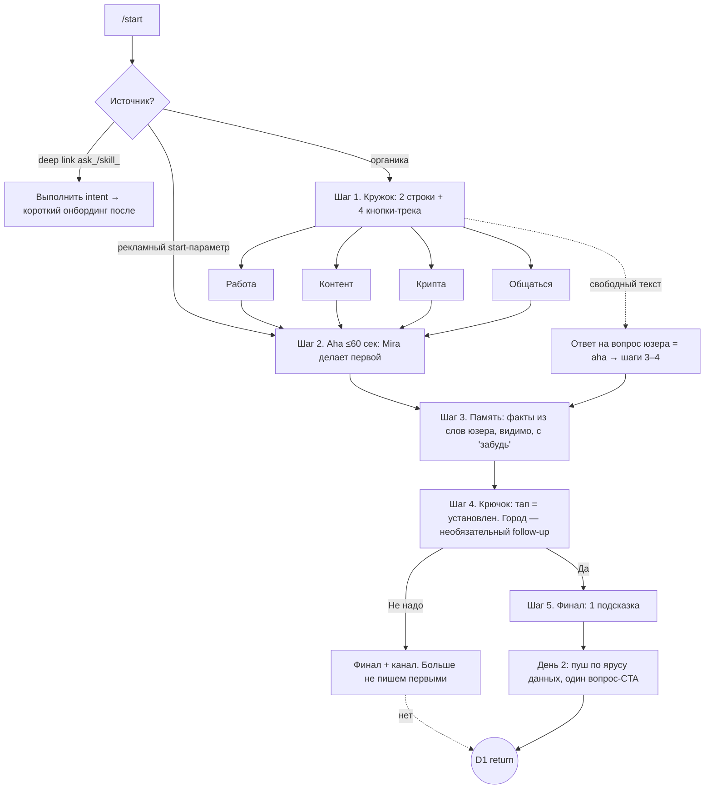

# PRD: Онбординг Mira

**Цель: максимальный D1 retention** · Автор: Максим Сироткин · Версия 0.8 · 14–15.07.2026
*(v0.2 внутренний гриллинг → v0.3 бенчмарк первых сессий → v0.4 вторые касания → v0.5 аудит mini-app визарда → v0.6 ответы команды: 0 токенов, без mini-app, дыра сетапа подтверждена → **v0.7 второй раунд ревью (CEO/CPO/аналитик): хотфикс-этап, анти-абьюз гранта, ярусы пуша, инверсия aha «Работы», фиксы метрик и выручка в контуре** → v0.8 live-наблюдение: у Mira есть recovery-пуш (generic, без 1-тапа), у лидера кнопки сразу в чате, паттерны Алисы)*

---

## 1. Контекст

Mira (@mira, ~444K MAU) — AI-агент внутри Telegram: чат с LLM, генерация изображений/видео/музыки, память, интеграции (Gmail, Calendar, Notion, GitHub и 200+), напоминания, Mira Daily, скиллы, TON-кошелек (testnet), групповые чаты. Чат и анализ бесплатны; генерация стоит токены (изображение 30 🪙, видео 200 🪙 — в вики 100, верим проду). **Новый юзер стартует с 0 токенов**; попытка генерации упирается в «пригласи друзей» (рефералка в проде, вознаграждение не коммуницируется). Без подписки — только бюджетные модели (MiniMax, DeepSeek, Qwen); топовые — в Mira Pro.

### Конкуренты в Telegram (MAU — публичные страницы t.me, 14.07.2026)

| Бот | MAU | Позиционирование | Retention-механика |
|---|---|---|---|
| @GPT4Telegrambot | 2,9M | Все модели в одном | Постоянный бесплатный тир + /premium апселл |
| Syntx AI | 452K | 90+ моделей, генерация | Приветственные токены + канал-сообщество (второе касание через 5 мин) |
| **Mira** | **444K** | **Агент: память + действия** | Daily-скиллы существуют, но спрятаны за анкетой |
| Grok (@GrokAI) | 35K | Grok 3, только Premium | Пейволл платформы |
| Microsoft Copilot | 17K | «Everyday AI companion» | — |

**Два вывода.** (1) Бренд не решает: Microsoft и xAI на порядок меньше Mira — выигрывают механики. (2) Лидер растет на «дешевом доступе ко всем моделям» — эту гонку не выиграть ценой; выигрывать надо тем, что не копируется квотой: память, проактивность, действия.

### Бенчмарк реальных первых сессий (скриншоты, 14.07.2026)

| Бот | Первое сообщение после /start | Что просит | Что дает сразу | Крючок на завтра |
|---|---|---|---|---|
| **Mira (текущая)** | Видео-кружок + `Let's go` → **mini-app визард 6 экранов** (роль, интент, имя) → подборка скиллов → сетап в чате через 3 открытых вопроса | **Анкету до ценности** | Ничего — за всю сессию ни одного результата | **Есть** (Daily Briefing/Motivation), но за анкетой и не в 1 тап |
| Syntx | «5.50 tokens credited» + тарифы + демо-видео | Разобраться в меню | Токены без задачи | Нет в боте; через 5 мин зовет в **канал-сообщество** (бродкаст, без персонализации) |
| GPT4Telegrambot | Команды + **inline-кнопки сразу в чате**; mini-app рекламируется как «проще и больше функций», но не обязателен | Нажать кнопку | Витрину + кнопки | Нет |

**Главный факт: никто в классе не доводит персональный триггер возврата до установки в один тап.** Канал Syntx — массовый бродкаст. Mira — единственная, кто пытается (Daily в подборке визарда, recovery-пуш «I'd love to write to you tomorrow» через ~1–2 ч после брошенного сетапа) — но каждая попытка снова требует усилия: анкета, mini-app, голосовое. И ценность за первую сессию не выдается ни разу.

**Полная картина текущего онбординга Mira** (аудит, 14.07): кружок + `Let's go` → визард: сплэш → «tell me about yourself» → роль (17 чипов) → интент (16 чипов) → имя (+«Random name») → подборка скиллов, вкл. Daily Briefing/Motivation. `Try` → 3 эссе-вопроса до какого-либо результата.

**Диагноз**: команда знает про крючок — проблема в **порядке и трении**:

1. **Инвестиция до ценности**: 6 экранов + 3 эссе-вопроса; aha не выдан — только обещан.
2. **Крючок не в 1 тап**: визард → подборка → `Try` → интервью; каждый шаг — точка потери.
3. **Лишние шаги**: экран имени (first_name есть), сплэш без действия.
4. **Разрыв метафоры**: продает «агента в чате», онбордит формой; матчинг подборки частичный.
5. **Дыра уточнена живым тестом** (вечер 14.07): `Try` на Daily → 3 вопроса → юзер молчит → Daily **не устанавливается**. Через ~1–2 ч приходит recovery-пуш: «I'd love to write to you tomorrow 🔔 …remind you to take pills, send BTC rate, nudge to drink water… Select a reminder in the app or send a voice 🎙». Интенция верная — Mira проактивно предлагает крючок. Исполнение с двойным трением: (а) контент generic — выбранные в визарде роль/интент/скилл проигнорированы (юзер выбрал PM + Daily Motivation, получил таблетки и воду); (б) CTA снова требует усилия — mini-app или голосовое, ни одной 1-тап кнопки. Дыра не в отсутствии recovery, а в том, что каждое касание Mira просит усилие вместо того, чтобы дать ценность и кнопку «да».
6. **Пейволл-шок** (факт): 0 токенов — интент «сгенерь картинку» встречает «пригласи друзей» вместо вау.

**Что честно берем у конкурентов**: welcome-токены первым касанием (Syntx) — но с задачей и анти-абьюзом; «чат бесплатный» против страха пейволла (лидер); второе касание «теплому» бросившему (тайминг Syntx); канал как бесплатный fallback для отказников.

### Паттерны за пределами Telegram

| Продукт | Паттерн | Берем? |
|---|---|---|
| ChatGPT | Suggestion chips, память | ✓ кнопки-подсказки; ✓ видимая память |
| Pi | Проактивные check-ins | ✓ ядро крючка (строго opt-in) |
| Replika / Character.ai | Персона, ежедневный ритуал | ✓ персона/стиль; ✗ стрики (v1) |
| Duolingo | Пуш-дисциплина + ровно один следующий шаг | ✓ один CTA на сообщение — без исключений |
| GPT4Telegrambot | Постоянный фри-тир; кнопки сразу в чате, mini-app опционален | ✓ проговариваем «чат бесплатный»; ✓ кнопочный чат-онбординг — норма поведения; daily free tokens — кандидат v2 |
| Алиса (Яндекс) | Контекстные подсказки-чипы после каждого ответа; пакетный утренний ритуал («Доброе утро») | ✓ чипы после каждого ответа первой сессии; утренний бриф уже в ядре флоу. (Онбординг Алисы посмотреть руками — веб дал только маркетинг) |

## 2. Проблема

Реальный сценарий гибели нового пользователя: /start → анкета → `Try` → еще вопросы → юзер закрыл Telegram, не получив ничего и не доустановив Daily → пуш не приходит → юзер не возвращается. Причины № 1, 2, 5, 6 выше — подтверждены аудитом и живым тестом; № 3–4 — гипотезы для проверки воронкой.

## 3. Ключевая идея

> **Онбординг не рассказывает, что умеет Mira. Он делает полезное сейчас — и договаривается о завтра.**

Формула D1 (Hooked): **Aha сейчас + Investment (память) + Trigger завтра**.

У Mira есть канал возврата, которого нет у обычных приложений: **бот может первым написать пользователю** — персонализированно, от агента, который тебя запомнил. Онбординг = ритуал установки этого крючка руками юзера.

**Это разворот порядка, не новая механика**: все блоки в проде (Daily, память, чипы). Было: анкета → обещание → крючок в конце пути потерь. Станет: ценность за 60 сек → память по ходу → крючок в 1 тап.

**Быстрая победа до всякого редизайна**: дыра №5 чинится хотфиксом («тап = пуш установлен, дефолты вместо вопросов») в текущем флоу — катим сразу, это самый дешевый подтвержденный рычаг D1 (§7, этап 0).

## 4. Цели и метрики

### North Star
**D1 retention новых пользователей** — ≥1 квалифицированное взаимодействие в **следующий календарный день по оцененной TZ юзера** (оценка TZ: час /start — люди стартуют в бодрствующие часы — + язык; уточняется городом, если юзер его назвал). Sensitivity-проверка: окно 24–48 ч. **Квалификация взаимодействия**: сообщение, голосовое, содержательный тап; **исключаются** тапы отключения/настройки пуша. Каждое возвратное событие тегируется: `return_trigger ∈ {organic, daily_push, reengagement, anon_link, channel}`.

**Знаменатель**: первый в истории /start по user_id (сверка с базой), антифрод-фильтр; трафик из ask_-ссылок и рефералки — отдельная страта, не в первичном анализе.

### Activation (прокси)

| Метрика | Определение | Роль |
|---|---|---|
| **Hook Setup Rate** ⭐ | % новых с ≥1 **явным opt-in** регулярного касания (тап по Daily / напоминание). Анонимная ссылка — НЕ крючок | Главный прокси D1 |
| Viral Link Activation | % пошаривших анонимную ссылку или получивших ≥1 клик по ней | Вирусная петля, отдельно |
| Aha Rate | % с событием `aha_delivered` — трек-специфичный результат выдан (для deep-link: интент выполнен) | Качество сессии |
| Memory Seed Rate | % с ≥2 фактами в памяти после сессии | Топливо пуша |
| TTFV | /start → первый ценный результат, цель ≤60 сек | Скорость |
| Push Reply Rate | % ответивших на D1-пуш | Качество крючка |

### Воронка (события)
`start` → `first_user_reply` → `track_selected | free_text_flow` → `aha_delivered` → `hook_setup` → `d1_return (return_trigger)`. Сегментация по источнику: органика / реклама / deep link.

### Guardrails
**D7 не хуже контроля с заданным non-inferiority margin**; block rate (через `my_chat_member`-webhook — симметрично для обеих рук); отключения пуша к D7; тикеты саппорта (с оговоркой о лаге); **invite/referral rate не хуже** (грант не должен каннибалить рефералку); **first purchase / конверсия в Pro на D7–14 и ARPU когорты не хуже** (D1 не покупаем ценой выручки); COGS на новичка.

## 5. Решение: флоу онбординга

### Принципы
- **Не модальный**: свободный текст всегда обрабатывается как обычный чат; intent юзера > сценарий. На свободном пути ответ на вопрос юзера **и есть aha** — шаги 3–4 вплетаются после.
- **Ценность до просьбы** — во всех треках без исключений.
- **Память видима и управляема**: показываем только факты, которые юзер сам сказал; «скажи "забудь" — удалю».
- **Один CTA на сообщение** (Duolingo-дисциплина), ≤60 сек до aha.
- **Чипы после каждого ответа** (паттерн Алисы/ChatGPT): в первой сессии каждое сообщение Mira заканчивается 2–3 контекстными кнопками — следующий шаг всегда в один тап, усилие никогда не обязательно.
- **Без mini-app** (вводная команды): онбординг целиком в чате; глубокая настройка в mini-app — опция для желающих. Экран имени убран (first_name есть).
- **Источник учитывается**: start-параметр рекламы ведет сразу в соответствующий трек, без выбора.
- **Пуш ярусами по полноте данных** (см. D1-пуш) — деградация задизайнена, а не случайна.

### Схема

**Шаг 1.** Формат из прода — видео-кружок (персона; **видеогенерацию в опенере не обещаем** — грант 30 🪙 ее не покрывает при цене 200 🪙), текст: 2 строки + 4 кнопки. Инверсия текущего опенера: не «расскажи о себе — потом буду полезной», а «выбери, что нужно — узнаю тебя по ходу».

### Треки: aha и крючок

| Трек | Aha ≤60 сек (Mira делает первой) | Крючок на завтра | Наполнение D2–D7 |
|---|---|---|---|
| 💼 Работа | **Инверсия**: Mira за ~10 сек сама рендерит мини-бриф-образец (день недели, погода по гипотезе TZ + один умный вопрос) → «хочешь такой каждое утро — под твои задачи?» | Тап = подписка на утренний бриф | В конце: «кинь 2–3 задачи на завтра — впишу в план» (investment ПОСЛЕ показанной ценности); фича дня 3 = «подключи Calendar — бриф соберется сам» |
| 🎨 Контент | **Welcome-грант 30 🪙 + 1 бесплатный ре-ролл** (первая генерация — лотерея, промах ре-роллим); первую генерацию маршрутизируем на **топ-модель** (копеечный фикс-COGS, честный Pro-тизер: «дальше эта модель — в Pro») | «Идеи контента каждое утро?» — пуш ведет в **бесплатное** (идеи текстом через Daily custom topics), генерация — опция | После генерации: «нужно еще — пригласи друга» (рефералка в момент желания); идеи ежедневно бесплатны |
| 💎 Крипта | Живые цены + «какие 1–3 монеты следишь?» → **портфель-лайт в памяти** → персональный разбор. Кошелек не продаем до mainnet | «Утренняя сводка по твоим монетам?» | Сводка по портфелю-лайт — персональна, не копируется каналом |
| 💬 Общаться | Выбор стиля (Friendly/Nerd/Cynic…) + личная ссылка анонимных вопросов. Обещание мягкое: «если кто-то спросит — принесу утром» | Крючок = сама Mira: «утром задам тебе вопрос дня в твоем стиле» (гарантировано) + анонимка сверху (негарантировано) | **Floor-механика**: пустой инбокс анонимки → пуш не «извини, вопросов нет», а вопрос дня от Mira |

Состав треков — гипотеза; валидируем статистикой выбора 16 интент-чипов текущего визарда (у команды уже есть данные). Слот «Крипта» — первый кандидат на замену (например, на «Учебу»: School Student/Student/Teacher — 3 из 17 ролей визарда).

**Шаг 3. Память.** По ходу диалога Mira сохраняет 2–3 факта **из сказанного юзером** и показывает: «📌 Запомнила: следишь за TON и ETH. Скажи "забудь" — удалю». Никаких выведенных из воздуха фактов.

**Шаг 4. Крючок.** Кнопки: `Да, в 8:30` / `Другое время` / `Не надо`. **Тап = крючок установлен, точка** — никаких обязательных вопросов (фикс подтвержденной дыры §1 п.5). Сразу после тапа — один **необязательный** follow-up: «Кстати, какой у тебя город? Подстрою время и погоду». Молчание не отменяет пуш: время — по гипотезе TZ (час /start + язык), при неподтвержденной TZ шлем в консервативное окно. `Не надо` = уважаем: больше не пишем первыми вообще, в финале предлагаем канал @miramedia_en (бродкаст, нулевой COGS).

**Шаг 5. Финал.** Ровно один CTA (подсказка следующего шага в треке). Баланс токенов показываем только если >0; вместо этого — «всегда бесплатно: чат, анализ фото, музыка, напоминания».

**День 2 — D1-пуш, ярусами по полноте данных:**

| Ярус | Данные | Пуш |
|---|---|---|
| A | TZ подтверждена + ≥2 факта | Полный персональный бриф/сводка + один вопрос-CTA |
| B | TZ гипотеза + 1–2 факта | Короткая версия по фактам, без погоды; в конце «поменяй время/темы одним словом» |
| C | Ничего, кроме трека | **Не маскируем под бриф** — один живой вопрос в тоне трека (для «Общаться» — вопрос дня в выбранном стиле) |

Один CTA на пуш; «фича дня» — только после ответа юзера, не в самом пуше. **Re-engagement через ~22 ч — только тем, кто бросил флоу без явного отказа** (нажавшим «Не надо» — не шлем ничего). Одно сообщение с конкретной ценностью по теме сессии; нет ответа → молчим.

### Edge cases
- **Deep link** (`ask_…`, скиллы): сначала интент, потом шаги 3–4 одним сообщением. Не ломать вирусные петли.
- **Свободный текст**: ответ = aha; шаги 3–4 вплетаются следом.
- **Брошенный онбординг («теплый»)**: молчит 10–15 мин до крючка → одно сообщение с самым дешевым действием (тайминг-паттерн Syntx). Ровно одно.
- **Прерванный онбординг**: продолжить с недостающего шага (макс. 1 раз).
- **Группы**: бот **не может** написать первым в личку добавившему (ограничение платформы) → кнопка-deep-link в приветствии в самой группе: «Настроить дайджест этого чата в личке».
- **Локализация**: EN основной, RU по языку клиента.

## 6. Экономика (для CFO/CEO)

- **Welcome-грант 30 🪙 + ре-ролл (только контент-трек)** — новая статья (сейчас 0 🪙). Обоснование: CAC уплачен, потеря юзера на пейволл-шоке дороже гранта. **Анти-абьюз**: грант начисляется после первого содержательного действия в треке (не по тапу), эвристики (возраст аккаунта, паттерн «грант→генерация→выход»), дневной кап, kill-switch; **self-referral не стакается с грантом**. Нужна цена токена в $ для месячного бюджета (§9).
- **Первая генерация и первый пуш — на топ-модели**: фиксированная копеечная стоимость на новичка, качество первого впечатления + честный Pro-тизер.
- **Рефералка не каннибалится, а встраивается**: грант закрывает первое желание, рефералка — второе («нужно еще»); invite rate в guardrails.
- **Пуши бесплатны** (вводная команды).
- **Путь к выручке**: D1 → привычка → генерации → Pro (апселл с D1+, через «фичу дня» после ответа юзера). **Критерий раскатки: аплифт D1 при неотрицательной дельте выручки (first purchase / Pro D7–14) и invite rate.**
- **Контраст с Syntx**: их retention — дешевый бродкаст; наш — персональный пуш (дороже, но дифференцирует агента), канал — fallback.

## 7. Эксперимент (кратко)

**Этап 0 — хотфикс без A/B (катим сразу)**: в текущем сетапе Daily — «тап = установлен, дефолты вместо вопросов». Чинит подтвержденную дыру, дает свежий бейзлайн; дешевейший рычаг D1.
**Этап 1 — A/B редизайна** поверх починенного контроля: 50/50 на новых (первый /start, антифрод), первичная метрика D1, вторичная D7 (с margin); внутри тритмента — push-holdout ~10% (никаких bot-initiated сообщений 7 дней — чистый organic-D7) и **грант-holdout** в контент-треке (30/0) — развязываем эффект хореографии от эффекта токенов. ask_/referral-трафик — отдельная страта. Набор ≥2 полных недель; мощность считаем по фактическому притоку первой недели. Межтрековые сравнения — описательные, не решающие.

## 8. Риски

| Риск | Митигция |
|---|---|
| **Абьюз гранта**: фарм мультиаккаунтами, self-referral | Грант после содержательного действия, эвристики, кап, kill-switch; self-referral не стакается; invite rate в мониторинге |
| **Zombie-D1**: пуш надувает D1 без привычки | D7 с margin, Push Reply Rate, push-holdout, `return_trigger`-таксономия |
| **Нерелевантный дефолтный пуш** (юзер ушел без данных) → снятый крючок | Ярусы A/B/C: пуш без данных не притворяется брифом |
| Первое впечатление на бюджетных моделях убивает вау и Pro-перспективу | Первая генерация и первый пуш — на топ-модели |
| Пуши → блоки | Только opt-in; «Не надо» = молчим навсегда; block через `my_chat_member` симметрично |
| COGS: токены гранта | Один трек, кап, cost per incremental D1 до раскатки |
| Онбординг мешает юзерам с готовым интентом | Свободный ввод приоритетен; start-параметр обходит выбор |
| Слом deep-link воронок | Отдельная короткая ветка |

## 9. Вопросы команде — статус

**Закрыто** (15.07): бейзлайн не важен, делаем свежее и без mini-app; текущий /start — аудит §1; 0 токенов у новичка, 30/200 🪙, фри-тир — бюджетные модели, рефералка есть; ограничений на пуши нет; EN преобладает; пуши бесплатны; A/B-инфраструктура и матчинг — не влияют на идею; брошенный сетап = пуш не приходит (подтверждено).

**Открыто:**
1. Mainnet кошелька (пока неясно) — до тех пор крипто-aha без кошелька.
2. Бюджет гранта: цена токена в $, кап; размер реферального вознаграждения (для копирайта и анти-каннибализации).
3. Когда показывать Pro (наше предложение: не раньше D1+, после ответа на пуш).
4. Статистика выбора 16 интент-чипов текущего визарда — для валидации состава 4 треков.

## 10. План работ

| Шаг | Артефакт | Статус |
|---|---|---|
| 1. Продукт, доки, конкуренты | §1–2 | ✅ |
| 2. PRD v0.1 → гриллинг (CPO/CEO/Growth/Tech/Data) → v0.2 | — | ✅ |
| 3. Бенчмарк первых сессий + аудит визарда + живые тесты (скриншоты) → v0.3–0.6 | §1–2 | ✅ |
| 4. Второй раунд ревью (CEO, CPO, аналитик — независимо) → v0.7 | Этот документ | ✅ |
| 5. Копирайт всех сообщений (EN) | В прототипе | ✅ |
| 6. Кликабельный прототип | index.html: 4 трека + свободный текст + ветка отказа, ярусы пуша A/B/C, легенда RU, автотест 13 сценариев | ✅ |
| 7. Деплой на GitHub Pages (yrze/miraonboarding) + письмо CPO | Инструкция + драфт готовы | ⏳ |

---

### Приложение: примеры копирайта (EN — как в проде; RU для ревью)

**Трек «Работа» (инверсия — ценность до просьбы):**

> **Mira:** Hi Maximus 👋 I'm Mira — I don't just answer, I get things done: I remember context, connect to your apps, and follow up on my own.
> What's your world?
> `[💼 Work & tasks]` `[🎨 Content]` `[💎 Crypto]` `[💬 Just talk]`

> **Mira:** *(~10 сек спустя, сама)* Here's what your tomorrow morning could look like:
> ☀️ *Tue, Jul 15 — 24°C, clear. One thing worth deciding today: what's the ONE task that makes everything else easier?*
> Want a brief like this every morning — built around *your* tasks?
> `[Yes, 8:30]` `[Another time]` `[No thanks]`

> **Mira:** *(после тапа Yes)* Done — tomorrow at 8:30 ✅
> Btw, what city are you in? I'll match the time and weather. *(можно не отвечать — пуш все равно придет)*

> **Mira:** *(если юзер назвал город/задачи)* 📌 Saved: Lisbon, launch on Friday. Say "forget it" and I'll delete.

**D1-пуш, ярус A:**

> **Mira:** Morning, Maximus ☀️ Lisbon: 24°C. Friday's launch is in 3 days — want a pre-launch checklist, or is there a bigger fire today?

**D1-пуш, ярус C (данных нет — не притворяемся брифом):**

> **Mira:** Morning ☀️ Quick one: if today had one hour fewer meetings, what would you spend it on? *(reply and I'll make it happen tomorrow)*
